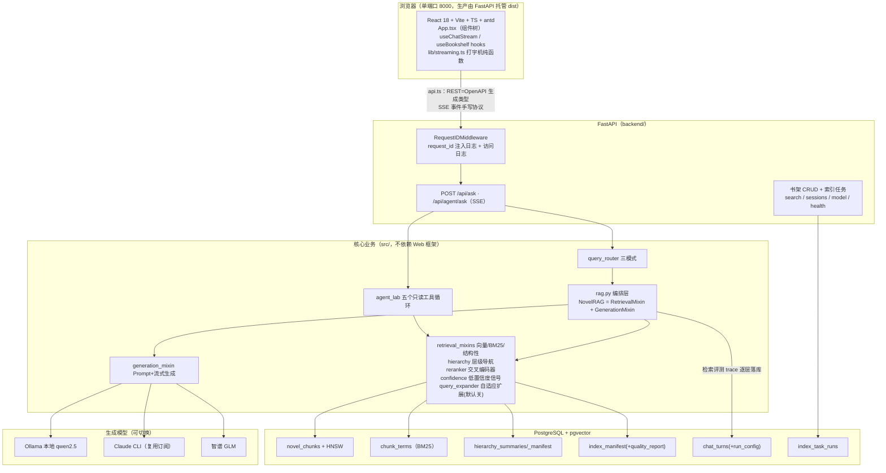
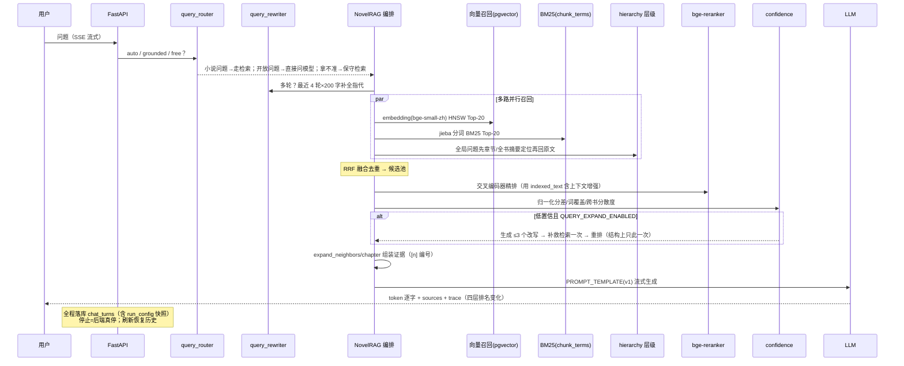
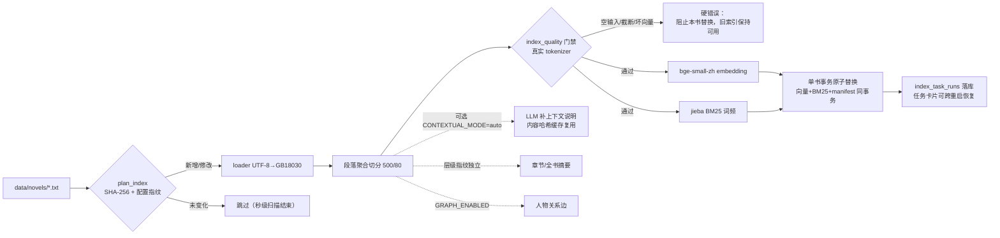
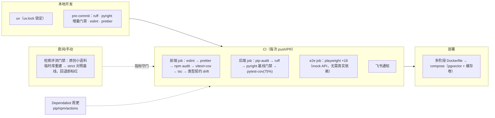

# 系统技术架构（2026-08 现状）

> 本文是当前代码结构的"一张图"版本：整体分层、一次问答的完整链路、索引流水线、
> 数据模型和工程化设施。各部分的深入讲解见对应专题文档（每节末尾有链接）。
> 图使用 mermaid，GitHub 上可直接渲染。

## 一、整体架构

要点：
- **src/ 不 import FastAPI**——评测脚本直接调 `NovelRAG`，Web 只是薄封装；
- **前后端类型契约**：`schemas.py` → `openapi.json` → `api-generated.ts`，
  CI drift 检查保证不漂移；
- **生成模型三通道**在 Web 层按前缀路由（`glm:` / `claude:` / 其余走 Ollama），
  src 层只认注入的生成函数。

## 二、一次原文问答的链路（标准 RAG 模式）

失败边界：任何一步无证据 → 明确拒答；补救重排失败 → 退回原结果；
trace 里能回答「正确片段在哪一步丢的」（召回/融合/精排/生成）。

## 三、索引流水线（增量 + 质量门禁）

一致性保证：取消/异常时**当前书**事务回滚，其他书不受影响；层级摘要算法变化只补
摘要不重算基础向量。质量门禁实测拦下过 chunk800 这类会被静默截断的配置。

## 四、数据模型

| 表 | 角色 | 关键点 |
|---|---|---|
| `novel_chunks` | 片段 + 向量 + 章节元数据 | 回答引用的事实来源 |
| `chunk_terms` | BM25 词频倒排 | 与向量同事务切换 |
| `index_manifest` | 文件哈希 + 流水线指纹 + quality_report | 增量同步的检查点 |
| `hierarchy_summaries/_manifest` | 章节/全书导航摘要 | 只做导航，证据必须回原文 |
| `chunk_contexts` / `graph_characters` | Contextual/关系图缓存 | 内容哈希主键，增量复用 |
| `chat_turns` | 会话历史 + trace + agent_steps + run_config | 刷新恢复、在线配置快照 |
| `index_task_runs` | 索引任务快照 | 重启后侧栏恢复卡片 |

## 五、工程化设施

质量数字（2026-08-22）：pytest 219 · vitest 19 · playwright 18 · pip-audit/npm audit 清零 ·
pyright 存量基线 35 条只拦增量 · 后端覆盖率 75%（观测基线）。

## 六、设计决策速查

| 决策 | 结论 | 出处 |
|---|---|---|
| 为什么不用 LangChain/LangGraph | 先看清数据流；触发条件到了再引入（M6.5 前） | [architecture-decisions](architecture-decisions.md) |
| 为什么留在 PostgreSQL | 中小规模 pgvector 即业界默认；混合检索同库同事务 | [rag-techniques](rag-techniques.md) |
| 为什么 monorepo 目录不拆 apps/ | 单产品拆目录是化妆性改动；类型契约用 OpenAPI codegen 解决 | 工程化阶段讨论记录 |
| Contextual Retrieval 为何默认 auto | 实测 4.4s/条；小书自动、大部头闸门拦截、后端可用性预检 | roadmap M3.4 |
| Judge 忠实度为何不上线 | 53 条标注集一致率最高 67.9% < 80% 门槛，影子调用 | [校准报告](experiments/m35-faithfulness-calibration.md) |
